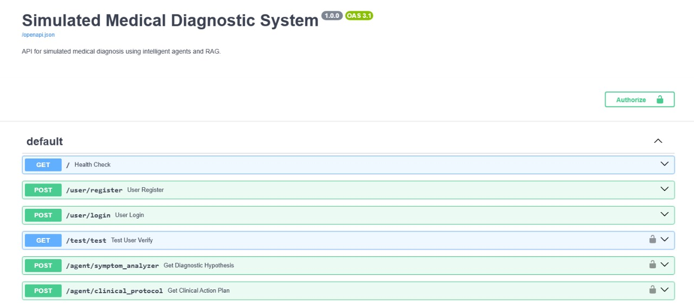

# Diagnóstico Médico IA

O projeto Diagnóstico Médico IA é uma API que utiliza agentes de IA para auxiliar no diagnóstico médico, baseando-se nos sintomas do paciente. Ele sugere exames e tratamentos, priorizando a segurança e eficácia. O sistema funciona analisando os sintomas fornecidos, formulando hipóteses diagnósticas com diferentes níveis de confiança e gravidade, e, em seguida, propondo um plano de ação que inclui exames para confirmar ou refinar o diagnóstico e tratamentos adequados.

> [!CAUTION]
> ESTE PROJETO NÃO DEVE SER USADO PARA TOMADAS DE DECISÃO E DIAGNÓSTICOS EM CASOS REAIS. SUA CONSTRUÇÃO TEM COMO OBJETIVO APENAS PARA PRÁTICA DOS CONHECIMENTOS EM AGENTES DE IA.

## Sumário

* [**Introdução**](#introdução)
* [**Rodando na sua máquina**](#rodando-na-sua-máquina)
* [**Recursos do projeto**](#recursos-do-projeto)
* [**Testes automatizados**](#testes-automatizados)
* [**Agendamento de tarefas**](#agendamento-de-tarefas)
* [**Conclusão**](#conclusão)

## Introdução

### Tecnologias escolhidas para o projeto:

Segue a lista das tecnologias usadas para a construção desse projeto:

* FastAPI (criação de API's);
* Agno (criação de Agentes de IA e RAG);
* Postgresql (banco de dados usado para usuários, memória do agente e sessão dos agentes);
* Qdrant (banco de dados vetorial para RAG);
* Groq (LLM usada nos agentes);
* Gemini (usamos aqui o embedder do gemini);
* Além de outras tecnologias como: pytest, sqlalchemy, etc.

### Recursos disponíveis:

* [**Testando API**](#testando-a-api)
* [**Documentação Swagger**](#documentação-swagger)
* [**Registro de usuário**](#registro-de-usuário)
* [**Login de usuário**](#login-de-usuário)
* [**Analisador de Sintomas (Agente A)**](#analisador-de-sintomas-agente-a)
* [**Protocolo Clínico (Agente B)**](#protocolo-clínico-agente-b)
* [**Orquestrador (combina os agentes para relatório completo)**](#testando-o-orquestrador-via-websocket)
* [**Agendamento de tarefas**](#agendamento-de-tarefas)

### Estrutura do projeto:

```bash
.
|---- app/
      |---- agents/
            |---- clinical_protocol.py
            |---- symptom_analyzer.py
      |---- auth/
            |---- auth_user.py
      |---- db/
            |---- base.py
            |---- connection.py
            |---- models.py
      |---- depends/
            |---- depends.py
      |---- routes/
            |---- agents_routes.py
            |---- user_routes.py
      |---- schemas/
            |---- agents_schemas.py
            |---- user_schemas.py
      |---- storage/
            |---- data/
                  |---- doenças_respiratorias.pdf
            |---- pg_storage.py
            |---- rag.py
      |---- main.py
|---- migrations/                                #arquivos de migração
|---- scripts/
      |---- cleanup_memory.py
|---- tests/
      |---- test_agent_endpoints.py
      |---- teste_qdrant.py
      |---- test_websocket_orchestrator.py
|---- .gitignore
|---- docker-compose.yml
|---- README.md
|---- requirements.txt
```

## Rodando na sua máquina

Para poder rodar este projeto na sua máquina, você deve ter instalado em sua máquina: 
> Python na versão `3.12.3`

> Pip na versão `24.0`

> Docker na versão `28.1.1`

> Postgresql na versão `16.9`  

Siga os passos abaixo para poder rodar:

### Clonando o repositório e instalando as dependências:

Primeiro vamos clonar o repositório do projeto na sua máquina local. No seu terminal rode o comando:

```bash
$ git clone https://github.com/JotahIvo/Medical-Diagnosis-AI.git
```

Navegue até a pasta raiz do projeto  para criar a virtual env do projeto:

```bash
$ cd Medical-Diagnosis-AI
$ python3 -m venv venv
$ source venv/bin/activate
```

Com a venv criada e ativada, instale os pacotes do python necessários para o projeto funcionar:

```bash
$ pip install -r requirements.txt
```

### Criando usuario e banco de dados postgres:

Abrir o terminal psql:

```bash
$ sudo -u postgres psql
```

Criar usuário e banco de dados:

```bash
postgres=$ CREATE USER <NOME_DO_USUARIO> WITH PASSWORD <SENHA_DO_USUARIO>;
postgres=$ ALTER USER <NOME_DO_USUARIO> SUPERUSER;
postgres=$ CREATE DATABASE <NOME_DO_BANCO> OWNER <NOME_DO_USUARIO>;
postgres=$ GRANT ALL PRIVILEGES ON DATABASE <NOME_DO_BANCO> TO <NOME_DO_USUARIO>;
```

### Criando seu .env para armazenar as credenciais e chaves de API:

Na pasta raiz do seu projeto crie um arquivo chamado `.env`, este arquivo vai conter todos os dados para autenticar suas LLM's, banco de dados e banco de dados vetorial. Caso tenha não possua essas chaves de API, acesse os sites abaixo para gerar suas API Keys:

* [Groq](https://console.groq.com/keys)
* [Qdrant](https://qdrant.tech/documentation/cloud-api/)
* [Google](https://ai.google.dev/gemini-api/docs/api-key)

Abra o arquivo .env e estruture suas variáveis da seguinte forma (lembre-se de colocar os seus valores):

```code
POSTGRES_USER=<SEU_USUARIO_POSTGRES>
POSTGRES_PASSWORD=<SUA_SENHA_POSTGRES>
POSTGRES_DB=<SEU_BANCO_POSTGRES>
DB_URL=<SUA_URL_BANCO_POSTGRES>
SECRET_KEY=<SUA_SECRET_KEY>
ALGORITHM=HS256                                           #Pode manter
GROQ_API_KEY=<SUA_API_KEY_GROQ>
GOOGLE_API_KEY=<SUA_API_KEY_GOOGLE>
QDRANT_API_KEY=<SUA_API_KEY_QDRANT>
QDRANT_URL=<SUA_URL_BANCO_QDRANT>
```

### Criando o banco postgres com docker:

Rode o comando abaixo para criar o seu banco de dados em um docker container:

```bash
$ docker compose up -d
```

### Rodando as migrações para criação de tabelas no Postgres

Esses comando servem para que as tabelas definida em app/db/models.py, sejam criadas no banco.

```bash
$ alembic revision --autogenerate -m "Adiciona a tabela de usuários"
$ alembic upgrade head
```

### Rodando o projeto localmente:

Agora finalmente temos tudo o que precisamos para rodar o projeto, execute o comando abaixo:

```bash
$ uvicorn app.main:app --host 0.0.0.0 --port 8000 --log-level debug 
```

Após executado, você pode acessar a url: `http://localhost:8000/docs`, esta url irá te direcionar para a documentação Swagger da API, onde você terá disponível todos os endpoints da aplicação, podendo testá-los ali mesmo, com exceção do orquestrador que é via WebSocket (vamos ver como testá-lo logo logo).

## Recursos do projeto:

Depois de rodar o projeto com `uvicorn`, temos acesso a URL do projeto para bater nos enpoints que realizam suas devidas ações.

### Testando a API:

Para testar se a API (Health Check) está funcionando.

| Método | URL | JSON Exemplo | Retorno |
|---|---|---|---|
| `GET` | `http://localhost:8000/` |  | {"message":"Welcome to the FastAPI application!","symptom_analyzer_agent_status":"Ready","clinical_protocol_agent_status":"Ready"} |

### Documentação Swagger:

Acesso a documentação do Swagger para a API, expondo os endpoint disponíveis.

| Método | URL | JSON Exemplo| Retorno |
|---|---|---|---|
| `GET` | `http://localhost:8000/docs/` |  | [Página da documentação]()



### Registro de Usuário:

Endpoint que permite a criação de um novo usuário da aplicação.

| Método | URL | JSON Exemplo| Retorno |
|---|---|---|---|
| `POST` | `http://localhost:8000/user/register/` | { "username": "admin", "password": "admin" } | { "msg": "success" }

### Login de usuário:

Endpoint que realiza o login do usuário e retorna um token JWT.

| Método | URL | JSON Exemplo| Retorno |
|---|---|---|---|
| `POST` | `http://localhost:8000/user/login/` | form-data: username e password | { "token_type": "bearer", "access_token": "eyJhbGciOiJIUzI1NiIsInR5cCI6IkpXVCJ9eyJzdWIiOiJhZG1pbiIsInVzZXJfaWQiOjQsImV4cCI6MTc1MTU5Nzk0MX0.MusYfkatTaf1B_uZ-R0sM8CTgt2vO9MReiSHUIC86DM", "expires_at": "2025-07-04T02:59:01.688382+00:00" }

### Analisador de sintomas (Agente A):

Esse é o endpoint que expõe o agente que analisa os sintomas, aqui você deve fornecer os sintomas que você está sentindo e ele te retornará um JSON contendo o seu diagnóstico, nivel confiança, justificativa e a severidade.

| Método | URL | JSON Exemplo| Retorno |
|---|---|---|---|
| `POST` | `http://localhost:8000/agent/symptom_analyzer/` | { "symptoms": "I'm nauseous", "session_id": "test_session_1234", "user_id": "5" } | { "diagnosis": "Suspected meningitis or severe viral illness (e.g., dengue, influenza)", "confidence": "Medium-High", "justification": "Persistent high-grade fever (39.5°C), headache, and nausea constitute a classic neurological 'red flag' triad requiring urgent evaluation.", "severity": "Critical" }

### Protocolo clínico (Agente B):

Esse é o endpoint do segundo agente, que ao enviarmos o retorno do analisador de sintomas, ele gera um novo JSON que contém a condição médica, grau de severidade, exames recomendados, sugestões de tratamentos, nível de urgência e justificativa.

| Método | URL | JSON Exemplo| Retorno |
|---|---|---|---|
| `POST` | `http://localhost:8000/agent/clinical_protocol/` | { "diagnosis": "Suspected meningitis or severe viral illness (e.g., dengue, influenza)", "confidence": "Medium-High", "justification": "Persistent high-grade fever (39.5°C), headache, and nausea constitute a classic neurological 'red flag' triad requiring urgent evaluation.", "severity": "Critical" } | NONE

## Testes automatizados

Usando o pytest, temos a possibilidade de automatizar os testes dos nossos endpoints, para que não seja necessário fazer requisições manualmente, seja com postman, insomnia, curl ou na própria documentação. Além de podemos automatizar os testes do endpoint dos agentes individualmente, podemos fazer também o teste do principal endpoint da aplicação, o `Orquestrador via WebSocket`.

### Testando os agentes individualmente:

Esse teste, simula de forma automática todas as ações do usuário, mas enviando uma requisição de cada vez para cada agente. Basta rodar o comando abaixo no seu terminal e ele irá: criar um usuário, efetuar login, enviar uma requisição para o agente analisador de sintomas e por fim enviar uma requisição para o agente de protocolo clínico. 

```bash
$ python -m pytest tests/test_agent_endpoints.py -s -v
```

Ao rodar esse comando observe os Logs para entender tudo que está acontecendo e também o retorno desses agentes.

### Testando o Orquestrador via WebSocket:

Finalmente chegamos ao "Boss final" do desafio, esse orquestrador, sintoniza os dois agentes, para que, ao usuário inserir os seus sintomas, ele retorna a resposta final da aplicação. Para realizar o teste automático, rode o comando abaixo:

```bash
$ python -m pytest tests/test_websocket_orchestrator.py -s -v
```

Após rodar esse comando no terminal, você poderá acompanhar todos os Logs descrevendo as ações do orquestrador e dos agentes, além de receber a resposta final.

## Agendamento de tarefas

### Limpar memória do agente:

Foi criado uma função em `./scripts/cleanup_memory.py`, que realiza a limpeza da memória do agente, essa função é chamada no `lifespan` da aplicação dentro de `./app/main.py`. O `lifespan` cuida das ações de inicialização e finalização da API, nele existe um `scheduler`, que chama a função `clear_agents_memory` para realizar a limpeza a cada 24 horas.

## Conclusão

Muito obrigado e espero que tenha gostado do projeto, caso gostou, deixe uma estrela!

Desenvolvido por João Pedro de Almeida Ivo.
